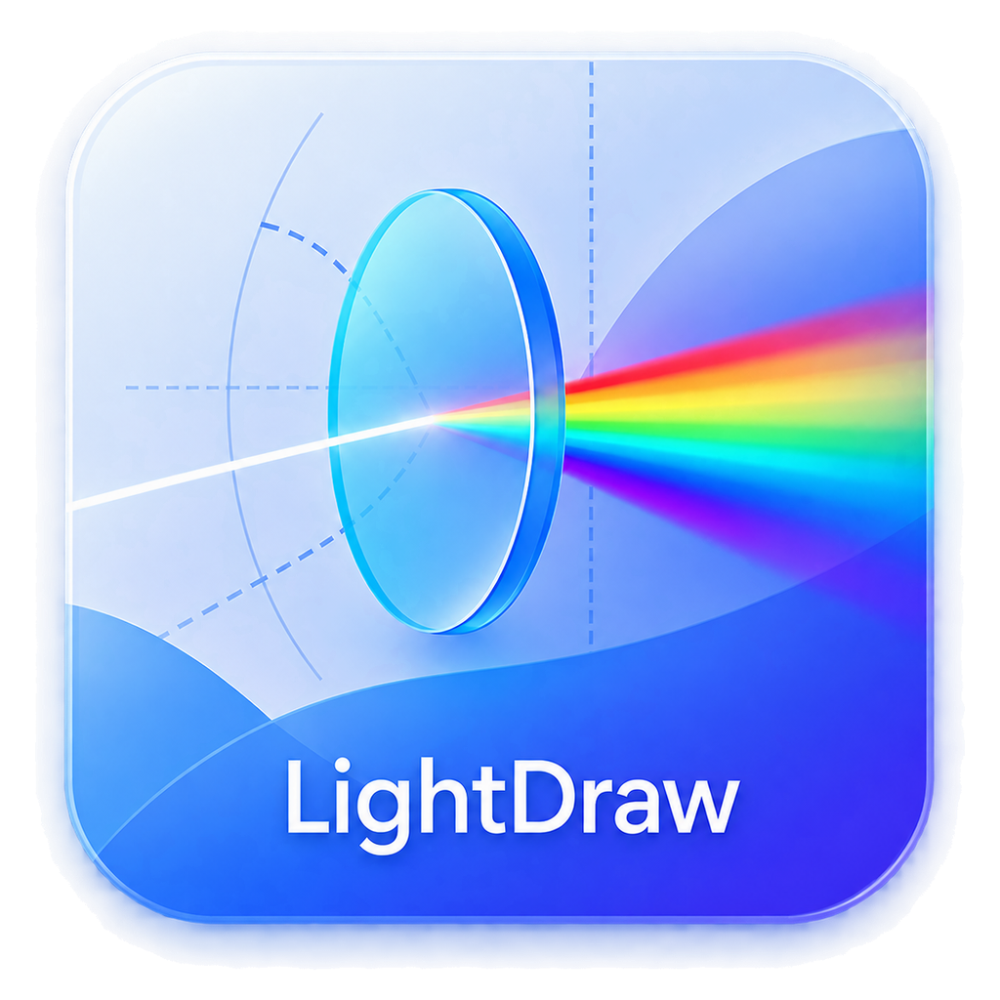
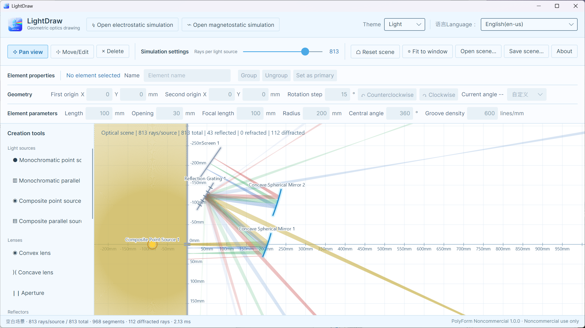
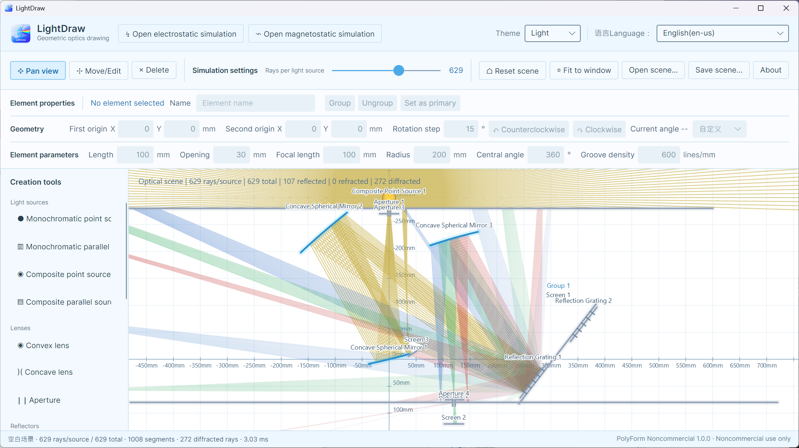
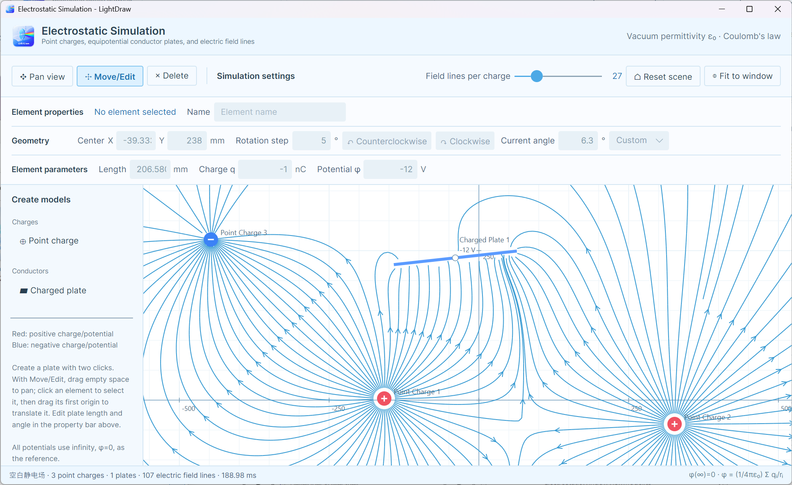
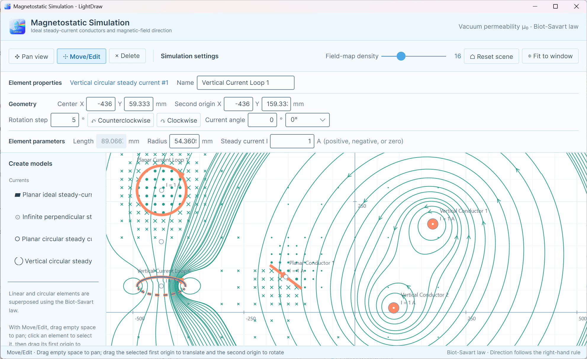

# LightDraw (光绘课堂)

[中文](README.md) | English

<p align="center">
  
  <br />
  <a href="https://apps.microsoft.com/detail/9P9JGS0LB77D?hl=zh-cn&amp;gl=CN&amp;ocid=pdpshare">
    
  </a>
</p>

**LightDraw (光绘课堂)** is a 2D drawing and simulation tool for physics lessons and demonstrations. The desktop edition supports geometric optics, electrostatics, and magnetostatics scenes; the browser edition currently provides a geometric optics canvas. Teachers can use it to demonstrate concepts, while students can build scenes, observe the results, and test their ideas.

The project is developed with public source code, community collaboration, and long-term maintenance in mind. Teachers, students, developers, designers, and optics enthusiasts are welcome to report issues, improve docs, add tests, or implement new features.

> [!IMPORTANT]
> This project is licensed under the [PolyForm Noncommercial License 1.0.0](LICENSE), for non-commercial use only. It is a source-available project, not OSI-defined open-source software. Without separate written permission from the copyright holder, this project and its derivatives must not be used for commercial products, paid services, commercial delivery, or other commercial purposes.

## Project Status

The LightDraw repository contains runnable desktop and browser editions. Their current scope is:

- **Desktop edition**: Runs on Windows, macOS, and Linux, with geometric optics, electrostatics, and magnetostatics simulations. A Windows installer is available through the Microsoft Store; portable cross-platform packages are published through [GitHub Releases](https://github.com/MatinxHT/LightDraw/releases).
- **Browser edition**: Provides the geometric optics canvas, scene files compatible with the desktop edition, PNG canvas export, Chinese and English interfaces, and light and dark themes. Electrostatics and magnetostatics scenes are omitted for performance reasons.
- **Shared code**: Both editions use the same pure .NET scene and simulation core, SkiaSharp optics canvas, and most main interface state and command logic.

The current version is suitable for classroom concept demonstrations and technical validation. It is not recommended for precision engineering calculations or research sensitive to numerical error.






## Quick Start

### Browser Edition

**Try it online:** [Open LightDraw in your browser](https://lightdraw.martinphysics.club/) to use the geometric optics canvas without installing the app.

The browser edition contains only the geometric optics canvas. Calculations run locally in the browser. Scenes are opened through the browser's file picker and saved as downloads; scene files do not need to be uploaded to a server. A desktop browser with a viewport of at least 920 px wide and 600 px high is recommended.

**Open scene** accepts a desktop-compatible `.lightdraw.json` file; **Save scene** downloads `lightdraw-scene.lightdraw.json`; **Export canvas** downloads `lightdraw-canvas.png`. The browser edition also has an **About** panel with the version, simulation methods, license, and acknowledgements.

### Requirements

- .NET SDK 10.0.400, or a compatible .NET 10 SDK as specified by `global.json`
- Desktop runtime: Windows 10/11, macOS, or Linux with X11/Wayland support
- The `wasm-tools` workload is also required to build the browser edition locally.

### Automated GitHub Releases

The `.github/workflows/release.yml` workflow runs when a `vMAJOR.MINOR.PATCH` tag is pushed. Update `<Version>` in `Directory.Build.props`, commit the change, and tag that commit with the matching version, for example:

```bash
git tag v0.7.3
git push origin v0.7.3
```

The tag must match the project version. The release title is the version without `v` (for example, `0.7.3`), and the application uses the same version. You can also enter an existing tag under Actions → Release desktop → Run workflow; the workflow must be on the default branch before its first manual run.

| Platform | Release assets |
| --- | --- |
| Windows x64 / ARM64 | `LightDraw-<version>-win-x64.zip` / `LightDraw-<version>-win-arm64.zip` |
| macOS Apple Silicon | `LightDraw-<version>-osx-arm64.tar.gz` (contains `LightDraw.app`) |
| Linux x64 / ARM64 | `LightDraw-<version>-linux-x64.tar.gz` / `LightDraw-<version>-linux-arm64.tar.gz` |

Each archive includes the .NET runtime, license, and documentation, with a separate `.sha256` checksum file. Extract and run `LightDraw.exe` on Windows, open `LightDraw.app` on macOS, or run `./LightDraw` on Linux. Linux still requires a desktop environment and Avalonia/Skia system dependencies. The macOS app is ad-hoc signed and is not Apple-notarized; its first launch may require permission in System Settings.

Each runner packages files on its temporary disk and uploads directly to a draft Release. The release becomes public only after all five builds succeed and all assets are present. Failures leave the draft available for retrying failed jobs in Actions. Published versions cannot be overwritten by the workflow; use a new version for subsequent releases. No Actions artifacts or dependency caches are used, so these storage quotas are not consumed. Actions execution time remains subject to the repository's GitHub billing rules.

### Microsoft Store bundle

On Windows with the Windows SDK 10.0.26100.0 packaging tools installed, run from the repository root:

```powershell
.\scripts\Package-MsixBundle.ps1
```

The script reads the project version from `Directory.Build.props`, publishes self-contained Release builds for x64 and ARM64, and combines them into `artifacts/msix/<version>/MartinHungChiho.LightDraw-<version>.msixbundle`. Use `-Version 0.7.3` to override both the application and package version. Each build uses a fresh staging directory to exclude obsolete published files.

Manually upload the `.msixbundle` on the Partner Center Packages page. The bundle retains the project's Store identity and publisher and has no local test signature; Microsoft Store signs it for distribution.

## Usage

| Action | Effect |
| --- | --- |
| Theme dropdown to the left of the top language selector | Instantly switch between dark/light themes across all windows; default is light (white canvas + pale blue UI); dark uses warm graphite panels, charcoal canvas, and champagne-colored selection accents |
| Language dropdown at the top | Switch interface text between Simplified Chinese and English |
| About | View the version, simulation methods, project repository, license, and acknowledgements; shown in a window on desktop and an in-page panel in the browser |
| Select the pan tool and drag with left mouse button | Pan the canvas |
| Move or adjust components | Dragging on blank space pans; click any component to select it, then drag the first anchor to translate; drag the white point located 100 mm along the orthogonal direction to rotate around a fixed origin; all lengths are edited in the property panel, and ray paths refresh in real time while dragging |
| Properties of a selected element | Edit its name, coordinates, and applicable optical parameters; group or ungroup elements and set the primary element of a group |
| Temporarily hide an element | Select an optical element and check **Temporarily hide**. The element remains visible on the canvas but is excluded from ray tracing, so rays pass through it |
| Delete a component | Click a light source, mirror, beam splitter, screen, aperture, grating, or lens to delete; after deletion, the tool automatically returns to pan mode |
| Hold right mouse button while using any drawing tool and drag | Temporarily pan the canvas |
| Scroll mouse wheel | Zoom centered at the current cursor position |
| Monochromatic point source | Single click to place; default wavelength is 580 nm with uniform 360° emission; after selection you can edit wavelength and emission spread, and rotate beam direction with the white rotation handle |
| Monochromatic parallel source | Click twice to define the emission segment; default wavelength is 580 nm and rays emit parallel to the segment normal; wavelength is editable after selection |
| Composite point source | Single click to place; composed of equal-strength 450/550/650 nm components, rendered yellow before dispersion; geometric editing is the same as monochromatic point source |
| Composite parallel source | Click twice to define the emission segment; composed of equal-strength 450/550/650 nm components, rendered yellow before dispersion; geometric editing is the same as monochromatic parallel source |
| Plane mirror / plane beam splitter / screen / aperture / reflection grating / convex lens / concave lens | First click sets start point, second click sets length and orientation, then the tool returns to pan mode; beam splitter preserves 50% intensity in both transmitted and reflected branches; rays stop when they hit a screen; reflection grating generates propagating diffraction orders by wavelength and groove density |
| Ideal concave spherical mirror / ideal convex spherical mirror | First click sets mirror vertex (first anchor), second click sets center of curvature (second anchor), direction, and initial radius; default central angle is 180°. During editing, the second anchor on canvas changes direction only and does not stretch radius; the property panel directly edits two anchor coordinates, central angle, radius, and focal length. When radius or focal length changes, the first anchor stays fixed, second anchor moves along current axis, and `f = R/2` is always enforced; concave/convex mirrors only reflect on the side facing/taking the opposite of the curvature center respectively |
| Concave grating | Same interaction as ideal concave spherical mirror: first click sets grating vertex, second click sets curvature center, direction, and radius; defaults: 180° central angle and 600 lines/mm. It only accepts rays incident from the concave side and generates diffraction orders on the local tangent plane using the reflection grating equation |
| Esc | Cancel placement of the current object |
| Reset scene | Clear all light sources and optical components, restoring a blank scene |
| Fit to window | Restore default viewport range |
| Ray density | Adjust the number of generated rays per source in real time |
| Open scene / Save scene | Read/write `.lightdraw.json` scene files |
| Export canvas | Export the current optical canvas as a PNG; choose a save location on desktop or download it directly in the browser |

## Edit protection and scene documents

Optics (desktop and browser), electrostatics and magnetostatics share a document toolbar:

- Undo/redo retains the last 100 completed edits. A drag is one edit; text properties commit on Enter or focus loss. Creating, deleting, grouping, renaming and hiding elements can all be undone. A new edit clears the redo branch.
- The unsaved marker compares scene content with the last successful save. Returning to saved content clears it. Pan, zoom and display density are not document edits.
- Opening, resetting and closing offer Save, Don’t save and Cancel when needed. Cancelled or failed saves preserve the current scene. Reset is undoable; opening another scene starts fresh history.
- Closing the main window or quitting reviews every simulation window before any closes. Cancelling any review keeps all windows open.
- Use Ctrl+Z, Ctrl+Shift+Z / Ctrl+Y, Ctrl+S and Ctrl+O; use ⌘ on macOS. Text fields retain their own text undo/redo.
- Local files are fully serialized and written to a temporary file before replacement. Other storage providers may not support atomic replacement.

The browser registers a native page-leave warning while dirty. The browser controls when it appears. Saving initiates a download; the application cannot confirm that it ultimately reaches disk. History lasts for the current session; automatic saving and crash recovery are not included.

Electrostatic and magnetostatic `.lightdraw.json` files use `sceneType` values `electrostatic` and `magnetostatic`, respectively, with independent `dataVersion: 1` formats. Open each in its corresponding window. All source geometry, physical parameters and names are preserved. Optical files retain version 14 and support valid versions 1–13.

Imports are limited to 16 MiB and 10,000 elements per collection. Invalid entries, duplicate optical IDs, non-finite numbers, numbers with magnitude above 10⁹ and zero-length elements are rejected before replacing a scene.

The optical editor is split into partial files for placement, selection, groups, properties, transforms, dragging, deletion and geometry. Normalization and history are independent Core components, and all three document workflows share `SceneDocumentViewModel<T>`.

Run the regression checks, including Avalonia Headless window integration tests:

```bash
dotnet run --project tests/LightDraw.Tests
```

See [tests/README.md](tests/README.md) for coverage and manual checks.

## Scene File Format

Scenes are UTF-8 JSON and use `dataVersion` for schema versioning. The current version is `14`, and versions `1` through `13` are still readable. All world coordinates, lengths, openings, radii, and focal lengths use millimeters (`mm`):

```json
{
  "dataVersion": 14,
  "scene": {
    "name": "Double Mirror Reflection Demo",
    "lightSources": [
      {
        "position": { "x": -300, "y": 20 },
        "directionDegrees": -8,
        "spreadDegrees": 38,
        "wavelengthNanometers": 580,
        "spectrum": "monochromatic"
      }
    ],
    "mirrors": [
      {
        "start": { "x": 40, "y": -170 },
        "end": { "x": 105, "y": 165 }
      }
    ],
    "concaveSphericalMirrors": [
      {
        "vertex": { "x": 0, "y": 0 },
        "centerOfCurvature": { "x": 100, "y": 0 },
        "arcAngleDegrees": 180
      }
    ],
    "convexSphericalMirrors": [
      {
        "vertex": { "x": 0, "y": 160 },
        "centerOfCurvature": { "x": 100, "y": 160 },
        "arcAngleDegrees": 120
      }
    ],
    "beamSplitters": [
      {
        "start": { "x": 120, "y": -100 },
        "end": { "x": 220, "y": 0 }
      }
    ],
    "screens": [
      {
        "start": { "x": 300, "y": -170 },
        "end": { "x": 300, "y": 165 }
      }
    ],
    "apertures": [
      {
        "start": { "x": 180, "y": -170 },
        "end": { "x": 180, "y": 165 },
        "openingSize": 60
      }
    ],
    "lenses": [
      {
        "start": { "x": 210, "y": -120 },
        "end": { "x": 210, "y": 120 },
        "kind": "convex",
        "focalLength": 300,
        "dispersionMode": "normal",
        "dispersionLevel": 5
      }
    ],
    "reflectionGratings": [
      {
        "start": { "x": 240, "y": -170 },
        "end": { "x": 240, "y": 165 },
        "grooveDensityLinesPerMillimeter": 600
      }
    ],
    "concaveGratings": [
      {
        "vertex": { "x": 360, "y": 0 },
        "centerOfCurvature": { "x": 460, "y": 0 },
        "arcAngleDegrees": 120,
        "grooveDensityLinesPerMillimeter": 600
      }
    ]
  }
}
```

Field notes:

- `dataVersion`: schema version for future data migration.
- `scene.name`: display name of the scene.
- `lightSources[].position`: light source position in world coordinates.
- `directionDegrees`: central emission direction in degrees. In move/edit mode, the second anchor of point sources and line elements is the white rotation point 100 mm from the first anchor; for concave/convex spherical mirrors, the second anchor remains the center of curvature.
- `spreadDegrees`: fan emission angle in degrees.
- `wavelengthNanometers`: wavelength in nanometers. Monochromatic sources default to 580 nm, and user-edited values are saved and directly used in grating equations. Composite sources use 550 nm as a reference in scene data, while actual dispersion uses fixed equal-strength 450/550/650 nm components.
- `spectrum`: spectrum type; `monochromatic` for monochromatic source, `composite` for composite source. Old scenes without this field are loaded as monochromatic.
- `kind`: source type, `point` or `parallelLine`; line sources also store an `end` point.
- `mirrors[].start/end`: two endpoints of a finite line-segment mirror.
- `concaveSphericalMirrors[].vertex`: mirror vertex (first anchor) of a concave spherical mirror; `centerOfCurvature` is the curvature center (second anchor), and the distance between them is the curvature radius; `arcAngleDegrees` is the central angle. Focal length is automatically derived by `f = R/2`.
- `convexSphericalMirrors[]`: same fields as concave spherical mirrors, but the effective reflective surface is on the side opposite the curvature center.
- `beamSplitters[].start/end`: two endpoints of a planar beam splitter; transmitted and reflected branches each keep 50% of incident intensity.
- `screens[].start/end`: two endpoints of a finite screen; rays terminate immediately on hit.
- `apertures[].start/end`: two endpoints of outer aperture segments; `openingSize` is the central opening size.
- `reflectionGratings[].start/end`: two endpoints of a reflection grating; `grooveDensityLinesPerMillimeter` is groove density (lines/mm).
- `concaveGratings[]`: concave gratings; geometric meaning of `vertex`, `centerOfCurvature`, and `arcAngleDegrees` matches ideal concave spherical mirrors, with `grooveDensityLinesPerMillimeter` for groove density.
- `lenses[].start/end`: two endpoints of thin lenses, plus `kind` and `focalLength`. Default reference focal length for new convex/concave lenses is 300 mm; converging/diverging behavior is determined by `kind`. `dispersionMode` can be `none`, `normal`, or `anomalous` (achromatic, normal dispersion, anomalous dispersion). `dispersionLevel` ranges 0–10 with default 5, active only in dispersion modes. Old scenes missing these fields migrate to `none` and `5`.
- Optical elements can store a custom `name` and `isTemporarilyHidden`. When the latter is `true`, the element is still drawn but ignored during ray tracing. A scene can also contain `groups` with member and primary element IDs. Older scenes without these fields remain readable.

For dispersive lenses, use 550 nm green-light focal length as `f₀`. Let `t = clamp((λ - 550) / 100, -1, 1)` and `s = dispersionLevel × 0.05`. Normal dispersion uses `f(λ) = f₀ × (1 + st)`, anomalous dispersion uses `f(λ) = f₀ × (1 - st)`. Therefore, with normal dispersion blue has shorter focal length and red has longer focal length (reversed for anomalous). At level 5 and base focal length 300 mm, focal lengths at 450/550/650 nm are 225/300/375 mm in normal dispersion. Composite light is split into three equal-strength components at its first hit on a dispersive lens; later lenses continue using each component wavelength without re-splitting.

Reflection gratings use the tangential wave-vector form of the grating equation. Convert wavelength from nm to mm first: `λ(mm) = λ(nm) × 10⁻⁶`, then solve propagating orders with `sin βₘ = sin α + mλ/d`, where `d` is grating spacing. For concave gratings, a local normal–tangent frame is built from spherical normal and its perpendicular direction at each hit point, then the same equation is applied. Thus, zeroth order reflects like a spherical mirror and keeps geometric focusing behavior `f = R/2`. Only orders 0, ±1, ±2, and ±3 are traced. Monochromatic light always uses user-set true wavelength for diffraction-angle calculations; render color is chosen by nearest reference wavelength: 390 nm purple, 450 nm blue, 550 nm green, 580 nm yellow, 650 nm red, so default 580 nm appears yellow. If target wavelength is exactly between two references, 580 nm yellow is treated as system center and the candidate closer to 580 nm is chosen. Composite light is rendered yellow before splitting; its non-dispersed zeroth order also remains one yellow mixed beam. Only ±1/±2/±3 orders split fixed 450/550/650 nm components and render them as blue/green/red while calculating angles by their own wavelengths. Initial component intensity ratio is 1:1:1; zeroth-order intensity is 90% of incident mixed beam, each ±1 component is 50% of its corresponding incident component, each ±2 is 25%, and each ±3 is 10%. A global line-segment cap is also applied to control interactive performance.

When evolving the file format, `dataVersion` should be incremented and an explicit migrator should be provided. Do not silently change meanings of existing fields.

## Technical Architecture

```text
LightDraw
├─ assets
│  └─ app-store          Version-controlled app store posters
├─ src/LightDraw.Core
│  ├─ Geometry           Vectors and foundational geometry types
│  ├─ Scene              Platform-independent scene models
│  ├─ Simulation         Ray generation, intersection, and reflection
│  ├─ Electromagnetics   Electrostatic/magnetostatic models and simulators
│  └─ Persistence        Versioned JSON scene read/write
├─ src/LightDraw.Rendering.Skia
│  ├─ Optics             Optical canvas, scene editing, and Skia rendering
│  ├─ Electrostatics     Interactive electrostatic canvas
│  └─ Magnetostatics     Interactive magnetostatic canvas
├─ src/LightDraw.Desktop
│  ├─ Views              Avalonia desktop windows and layouts
│  ├─ ViewModels         Main interface state and commands shared by both editions
│  ├─ Services           Local file selection, scene storage, and localization
│  └─ Assets             In-app branding and icon assets
└─ src/LightDraw.Browser
   ├─ Views              Avalonia browser interface and About panel
   ├─ Services           Browser file selection, downloads, and scene storage
   └─ wwwroot            WebAssembly entry point, scripts, and static assets
```

Dependency direction is:

```text
LightDraw.Core ← LightDraw.Rendering.Skia ← LightDraw.Desktop / LightDraw.Browser
```

`LightDraw.Core` does not reference Avalonia, SkiaSharp, Windows API, or macOS API, so it can be tested independently and is already reused by the browser edition. The browser edition also reuses the optical canvas, main interface ViewModel, and localization service; browser-specific code handles file selection and downloads. The root `assets/app-store` directory holds version-controlled store graphics. Build, publish, and package outputs are not version controlled.

### Simulation and Rendering

`RayTracer` computes scenes into UI-agnostic ray segment collections. `OpticalCanvas` obtains the current SkiaSharp canvas inside Avalonia custom draw operations, merges segments into paths, and draws in batches. Only data is passed between simulation and rendering layers, making it easier to add background computation, cancellation tokens, spatial indexing, and pluggable simulation engines in the future.

## Design Principles

- **Teaching first**: interactions and terminology should favor classroom demonstration over engineering-software-style parameter overload.
- **Compute/UI separation**: core algorithms should not depend on desktop frameworks.
- **Cross-platform consistency**: avoid unnecessary platform-specific APIs.
- **Scalable performance**: prioritize batched computation and batched rendering for large ray counts.
- **Migratable formats**: all persisted data has explicit versioning.
- **Community co-building**: major behavior changes require tests, docs, and clear commit messages.

## Contributing

Issue reports, classroom use cases, bilingual documentation improvements, test additions, accessibility support, performance optimization, and new optical elements are all welcome. Please read [CONTRIBUTING.en.md](CONTRIBUTING.en.md) before coding. For large features, open an Issue first and explain use case, interaction design, and algorithmic rationale.

By submitting contributions, you confirm you have rights to provide the content and agree to license contributions under this repository’s current PolyForm Noncommercial License 1.0.0. Do not directly copy code, images, fonts, exercises, or teaching materials with incompatible licenses or unclear provenance.

## License and Usage Boundaries

Project code is licensed under the **PolyForm Noncommercial License 1.0.0**. Full terms are in [LICENSE](LICENSE). Quick interpretation:

- Personal learning, research, experiments, teaching, and non-commercial hobby projects are allowed.
- Educational institutions, charities, public research organizations, and government organizations may use it as permitted by the license.
- Modification and redistribution are allowed for non-commercial purposes, with required license and notices.
- Commercial products, paid services, commercial delivery, or intended commercial use are not authorized.
- This summary is for understanding only; if it conflicts with `LICENSE`, the English license text prevails.
- For commercial licensing or uncertain use cases, contact the copyright holder first and obtain written permission.

Because specific commercial uses are prohibited, this project does not meet the [Open Source Initiative definition of open-source software](https://opensource.org/osd). Please describe it as “source-available,” “public-source,” or a “community collaboration project,” and avoid labeling it as OSI-approved open source.

Third-party dependencies keep their own original licenses, and this license does not alter those terms. If code from other projects (including `ricktu288/ray-optics`) is referenced or ported in the future, license-compatibility checks must be completed first, required notices must be preserved, and source records must be explicit. License-incompatible code must not be merged directly.

## Acknowledgements and Inspiration

LightDraw was inspired by [Ray Optics Simulation](https://github.com/ricktu288/ray-optics). That project demonstrates a rich 2D geometric optics editor, simulation engine, and interactive presentation experience, showing how abstract optics concepts can become intuitive visual tools.

Special thanks to the author and all contributors of `ricktu288/ray-optics` for their long-term design, development, and community maintenance work.

LightDraw is an independent project exploring cross-platform classroom experience with .NET, Avalonia, and SkiaSharp. It has no official affiliation, collaboration, or endorsement relationship with Ray Optics Simulation. “Inspired by” does not imply direct code copying. If any code or assets from that project are ever actually referenced, translated, or ported, Apache License 2.0 copyright, license text, and required notices will be preserved, with explicit records of source and modifications in this repository.

## Disclaimer

LightDraw is provided “as is” under its license, without express or implied warranties. Simulation results are intended mainly for teaching and demonstration, and should not be used as the sole basis for engineering design, experiment safety, or professional decision-making.
