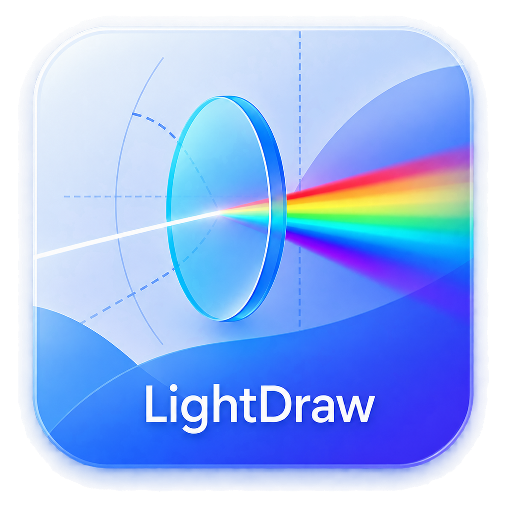
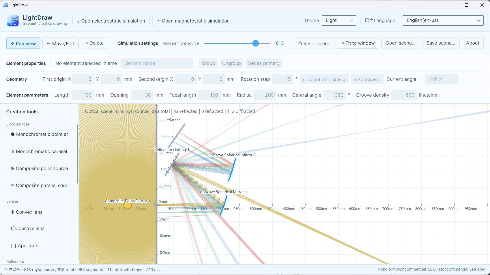
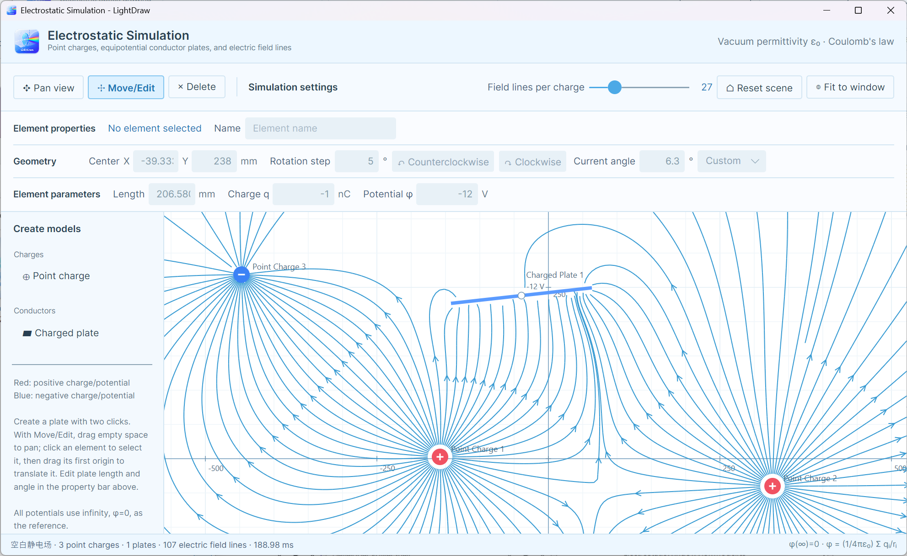
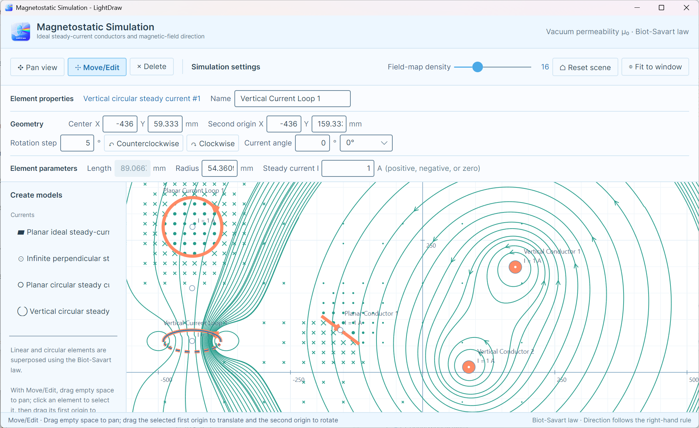

# 光绘课堂 (LightDraw)

<p align="center">
  
  <br />
  <a href="https://apps.microsoft.com/detail/9P9JGS0LB77D?hl=zh-cn&amp;gl=CN&amp;ocid=pdpshare">
    
  </a>
</p>

**光绘课堂 (LightDraw)** 是一款面向中小学物理课堂、实验演示和几何光学学习的跨平台二维光学绘图与模拟工具。项目希望用直观、流畅的可视化方式帮助教师讲解光的传播与反射，也让学生能够自由搭建场景、观察光路并验证自己的猜想。同时光是电磁波，所以也提供静电场和静磁场模拟仿真供教学使用。

项目以公开源码、社区协作和长期维护为方向。欢迎教师、学生、开发者、设计师和光学爱好者提交问题、改进文档、补充测试或实现新功能。

> [!IMPORTANT]
> 本项目采用 [PolyForm Noncommercial License 1.0.0](LICENSE)，仅授权非商业用途。它是“源码可用（source-available）”项目，不是 OSI 定义下的开源软件。未经版权所有者另行书面许可，不得将本项目或其衍生版本用于商业产品、收费服务、商业交付或其他商业目的。

## 项目状态

光绘课堂目前处于早期开发阶段。仓库已经包含可运行的桌面基础版本，主要用于验证以下技术路线：

- 纯 .NET 几何光学计算核心；
- Avalonia 跨平台桌面界面；
- SkiaSharp 高性能批量绘图；
- Windows、macOS 和 Linux 的统一代码基础；
- 兼容应用商店沙盒的场景文件读写。

当前版本适合开发预览、课堂概念演示和技术验证，尚不建议用于精密工程计算或对数值误差敏感的科研工作。





## 快速开始

### 环境要求

- .NET SDK 10.0.400，或与 `global.json` 兼容的 .NET 10 SDK；
- Windows 10/11、macOS，或支持 X11/Wayland 的 Linux；
- 可选 IDE：JetBrains Rider、Visual Studio 或 Visual Studio Code。

先确认本机 SDK：

```powershell
dotnet --info
```

### 还原、构建与运行

在仓库根目录执行：

```powershell
dotnet restore LightDraw.slnx
dotnet build LightDraw.slnx -c Release
dotnet run --project src/LightDraw.Desktop/LightDraw.Desktop.csproj
```

首次还原需要连接 NuGet。仓库启用了可空引用类型、确定性构建和“警告视为错误”，提交代码前应确保 Release 构建无警告通过。

## 使用说明

| 操作 | 效果 |
| --- | --- |
| 选择平移工具并按住鼠标左键拖动 | 平移画布 |
| 移动或调整元件 | 空白处按住左键可平移界面；先单击元件任意位置选中，再按住第一原点拖拽平移；拖动元件正交方向 100 mm 处的白点可固定元件原点旋转；所有长度只能通过属性框修改，光路在拖动时实时刷新 |
| 删除元件 | 单击光源、镜面、分光镜、光屏、光阑、光栅或透镜即可删除，成功删除后自动返回平移工具 |
| 使用任意绘制工具时按住右键拖动 | 临时平移画布 |
| 滚动鼠标滚轮 | 以当前指针位置为中心缩放 |
| 单色点光源 | 单击放置，默认波长为 580 nm 并向 360° 均匀发光；选中后可修改波长和发射圆心角，并用白色旋转点调整光束中心方向 |
| 单色平行光源 | 两次点击确定发射线段，默认波长为 580 nm 并沿线段法线方向平行发射；选中后可修改波长 |
| 复色点光源 | 单击放置，由 450、550、650 nm 三个等强分量混合，分光前以黄色绘制；几何编辑方式与单色点光源相同 |
| 复色平行光源 | 两次点击确定发射线段，由 450、550、650 nm 三个等强分量混合，分光前以黄色绘制；几何编辑方式与单色平行光源相同 |
| 平面反光镜 / 平面分光镜 / 光屏 / 光阑 / 反射光栅 / 凸透镜 / 凹透镜 | 第一次点击确定起点，第二次点击确定长度和朝向，随后自动返回平移工具；分光镜让透射光和反射光各保留入射光强的 50%；光屏命中后直接截停光线；反射光栅按波长与刻线密度生成可传播衍射级次 |
| 理想凹球面镜 / 理想凸球面镜 | 第一次点击确定镜面中心点（第一原点），第二次点击确定球心（第二原点）、方向和初始半径；默认圆心角为 180°。编辑时画布上的第二原点只改变方向、不拉伸半径；属性栏可直接编辑两个原点坐标、圆心角、半径与焦距。修改半径或焦距时第一原点固定，第二原点沿当前轴线移动，且始终满足 `f = R/2`；凹、凸镜分别只在朝向球心和背向球心的一侧反射 |
| Esc | 取消正在放置的物件 |
| 重置场景 | 清空所有光源和光学元件，恢复空白场景 |
| 适合窗口 | 恢复默认视图范围 |
| 光线密度 | 实时调整每个光源生成的光线数量 |
| 打开场景 / 保存场景 | 读写 `.lightdraw.json` 场景文件 |

## 场景文件格式

场景使用 UTF-8 JSON，并通过 `dataVersion` 标记数据结构版本。当前版本为 `10`，并可继续读取版本 `1`～`9`。所有世界坐标、长度、通孔、半径和焦距均以毫米（`mm`）计：

```json
{
  "dataVersion": 10,
  "scene": {
    "name": "双镜面反射演示",
    "lightSources": [
      {
        "position": { "x": -300, "y": 20 },
        "directionDegrees": -8,
        "spreadDegrees": 38,
        "wavelengthNanometers": 580,
        "spectrum": "monochromatic"
      }
    ],
    "mirrors": [
      {
        "start": { "x": 40, "y": -170 },
        "end": { "x": 105, "y": 165 }
      }
    ],
    "concaveSphericalMirrors": [
      {
        "vertex": { "x": 0, "y": 0 },
        "centerOfCurvature": { "x": 100, "y": 0 },
        "arcAngleDegrees": 180
      }
    ],
    "convexSphericalMirrors": [
      {
        "vertex": { "x": 0, "y": 160 },
        "centerOfCurvature": { "x": 100, "y": 160 },
        "arcAngleDegrees": 120
      }
    ],
    "beamSplitters": [
      {
        "start": { "x": 120, "y": -100 },
        "end": { "x": 220, "y": 0 }
      }
    ],
    "screens": [
      {
        "start": { "x": 300, "y": -170 },
        "end": { "x": 300, "y": 165 }
      }
    ],
    "apertures": [
      {
        "start": { "x": 180, "y": -170 },
        "end": { "x": 180, "y": 165 },
        "openingSize": 60
      }
    ],
    "reflectionGratings": [
      {
        "start": { "x": 240, "y": -170 },
        "end": { "x": 240, "y": 165 },
        "grooveDensityLinesPerMillimeter": 600
      }
    ]
  }
}
```

字段说明：

- `dataVersion`：场景文件格式版本，用于未来的数据迁移；
- `scene.name`：场景显示名称；
- `lightSources[].position`：光源在世界坐标系中的位置；
- `directionDegrees`：中心出射方向，单位为度；移动/编辑属性栏中，点光源及线状元件的第二原点表示距第一原点 100 mm 的白色旋转点，凹、凸球面镜的第二原点仍表示曲率圆心；
- `spreadDegrees`：扇形发射角度，单位为度；
- `wavelengthNanometers`：波长，单位为纳米；单色光源默认为 580 nm，用户修改后的真实值会保存并直接参与光栅方程计算。复色光源在场景中以 550 nm 作为参考值，实际分光计算使用不可修改的 450、550、650 nm 三个等强分量；
- `spectrum`：光谱类型，`monochromatic` 为单色光源，`composite` 为复色光源；旧场景未包含此字段时按单色光源读取；
- `kind`：光源类型，`point` 或 `parallelLine`；线光源还会保存 `end` 端点；
- `mirrors[].start/end`：有限线段镜面的两个端点。
- `concaveSphericalMirrors[].vertex`：凹球面镜的镜面中心点（第一原点）；`centerOfCurvature` 为球心（第二原点），两点距离为曲率半径；`arcAngleDegrees` 为镜面圆心角，焦距由 `f = R/2` 自动确定。
- `convexSphericalMirrors[]`：字段与凹球面镜一致，但有效反射面位于背向球心的一侧。
- `beamSplitters[].start/end`：平面分光镜的两个端点；透射和反射分支的光强各为入射光的 50%。
- `screens[].start/end`：有限线段光屏的两个端点；命中光屏后光线立即终止传播。
- `apertures[].start/end`：光阑外部线段的两个端点；`openingSize` 为中央通孔大小。
- `reflectionGratings[].start/end`：反射光栅的两个端点；`grooveDensityLinesPerMillimeter` 为刻线密度（线/mm）。
- `lenses[].start/end`：理想薄透镜的两个端点，另含 `kind` 与 `focalLength`；新建凸、凹透镜的默认焦距均为 300 mm，聚散性质由 `kind` 决定。

反射光栅采用切向波矢形式的光栅方程。计算时先将波长从纳米换算为毫米：`λ(mm) = λ(nm) × 10⁻⁶`，再按 `sin βₘ = sin α + mλ/d` 求可传播级次，其中 `d` 为光栅常数。仅追踪 0、±1、±2、±3 级。单色光始终使用用户设置的真实波长计算衍射角；绘制颜色则与参考表做绝对差最小匹配：390 nm 紫色、450 nm 蓝色、550 nm 绿色、580 nm 黄色、650 nm 红色，因此默认 580 nm 显示为黄色。若目标波长恰好位于两个参考值的中点，则以黄色 580 nm 为系统重心，选择两个候选颜色中更靠近 580 nm 的一侧。复色光在分光前以黄色绘制，其无色散的 0 级也保留为一条黄色混合光；只有 ±1、±2、±3 级会将固定的 450、550、650 nm 分量分别以蓝、绿、红色绘制，并按各自波长计算色散角。三个分量的初始强度比为 1:1:1；0 级光强为入射混合光的 90%，+1 与 -1 级的各波长分量为对应入射分量的 50%，+2 与 -2 级各为 25%，+3 与 -3 级各为 10%。另设全场景线段数量上限以控制交互性能。

未来修改格式时应提升 `dataVersion` 并提供显式迁移器，不应静默改变已有字段的含义。

## 技术架构

```text
LightDraw
├─ assets
│  └─ app-store          受版本控制的应用商店海报
├─ src/LightDraw.Core
│  ├─ Geometry           向量和几何基础类型
│  ├─ Scene              平台无关的场景模型
│  ├─ Simulation         光线生成、求交和反射
│  ├─ Electromagnetics   静电场与磁静态模型及模拟器
│  └─ Persistence        带版本号的 JSON 场景读写
├─ src/LightDraw.Rendering.Skia
│  ├─ Optics             光学画布、场景编辑和 Skia 绘制
│  ├─ Electrostatics     静电场交互画布
│  └─ Magnetostatics     磁静态交互画布
└─ src/LightDraw.Desktop
   ├─ Views              Avalonia 窗口和界面布局
   ├─ ViewModels         窗口状态与命令
   ├─ Services           文件选择与场景存储服务
   └─ Assets             应用内使用的品牌和图标资源
```

依赖方向保持为：

```text
LightDraw.Core ← LightDraw.Rendering.Skia ← LightDraw.Desktop
```

`LightDraw.Core` 不引用 Avalonia、SkiaSharp、Windows API 或 macOS API，因此可以独立测试，也便于未来复用于命令行工具、WebAssembly 或其他前端。仓库根部的 `assets/app-store` 保存需要纳入版本控制的商店展示海报；构建、发布和打包产生的文件仍输出到被 Git 忽略的 `artifacts` 目录。

### 模拟与绘制

`RayTracer` 将场景计算为与 UI 无关的光线线段集合。`OpticalCanvas` 在 Avalonia 的自定义绘制操作中获取当前 SkiaSharp 画布，将线段合并到路径后批量绘制。模拟层和显示层之间只传递数据，以便未来加入后台计算、取消令牌、空间索引和可插拔模拟引擎。

## 设计原则

- **教学优先**：交互和术语应便于课堂演示，而不是堆叠工程软件式参数；
- **计算与界面分离**：核心算法不依赖桌面框架；
- **跨平台一致**：避免无必要的平台专属 API；
- **性能可扩展**：大量光线优先批量计算和批量绘制；
- **格式可迁移**：所有持久化数据都有显式版本；
- **社区共建**：重要行为变更需要测试、文档和清晰的提交说明。

## 参与贡献

欢迎报告缺陷、提出课堂需求、完善中英文文档、补充测试与无障碍支持、优化性能或实现新的光学元件。开始编码前请阅读 [CONTRIBUTING.md](CONTRIBUTING.md)。较大的功能建议先创建 Issue，说明使用场景、交互方案和算法依据。

提交贡献即表示你有权提供相关内容，并同意将该贡献按照本仓库当前的 PolyForm Noncommercial License 1.0.0 提供。请勿直接复制许可证不兼容或来源不明的代码、图片、字体、题目和教学材料。

## 许可证与使用边界

项目代码采用 **PolyForm Noncommercial License 1.0.0**，完整条款见 [LICENSE](LICENSE)。简要理解如下：

- 允许个人学习、研究、实验、教学和非商业爱好项目使用；
- 允许教育机构、慈善机构、公共研究机构和政府机构等按许可证规定使用；
- 允许在非商业目的范围内修改和分发，并须同时提供许可证及必要声明；
- 不授权将项目或衍生版本用于商业产品、收费服务、商业交付或预期的商业应用；
- 本摘要仅用于帮助理解，若与 `LICENSE` 正文冲突，以英文许可证正文为准；
- 商业授权或对具体使用方式有疑问时，应先联系版权所有者并取得书面许可。

由于禁止特定商业用途，本项目不符合 [Open Source Initiative 对开源软件的定义](https://opensource.org/osd)，请使用“源码可用”“公开源码”或“社区协作项目”描述本项目，避免标注为 OSI-approved open source。

本项目依赖的第三方组件仍分别遵循其原有许可证，本许可证不会改变第三方组件的授权条款。若未来参考或移植其他项目（包括 `ricktu288/ray-optics`）的代码，必须先完成许可证兼容性检查、保留所需声明并明确记录来源；许可证不兼容的代码不得直接合入。

## 致谢与灵感来源

光绘课堂的创作灵感来自 [Ray Optics Simulation](https://github.com/ricktu288/ray-optics)。该项目提供了功能丰富的二维几何光学场景编辑、模拟与交互式演示，让我们看到了将抽象光学知识转化为直观可视化工具的可能性。

在此特别感谢 `ricktu288/ray-optics` 的作者和所有贡献者长期以来的设计、开发与社区维护工作。

光绘课堂是使用 .NET、Avalonia 和 SkiaSharp 探索跨平台课堂教学体验的独立项目，与 Ray Optics Simulation 不存在官方隶属、合作或背书关系。“受到启发”不代表直接复制其代码；如果未来实际引用、翻译或移植该项目的任何代码或资源，将按其 Apache License 2.0 保留版权、许可证及其他必要声明，并在仓库中明确记录来源和修改内容。

## 免责声明

光绘课堂按许可证规定“按原样”提供，不附带任何明示或默示保证。模拟结果主要用于教学和演示，不构成工程设计、实验安全或专业决策依据。
